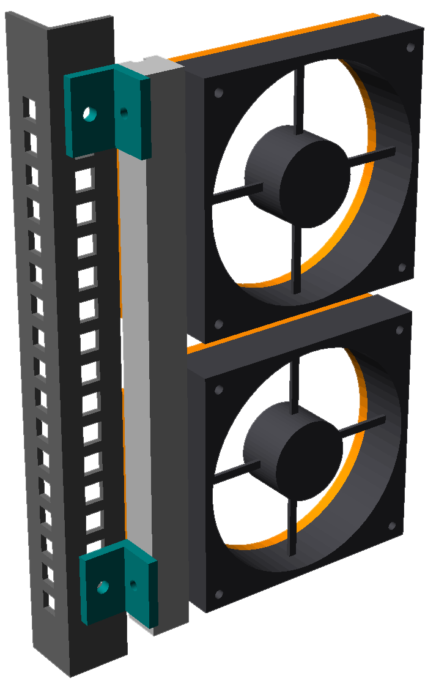
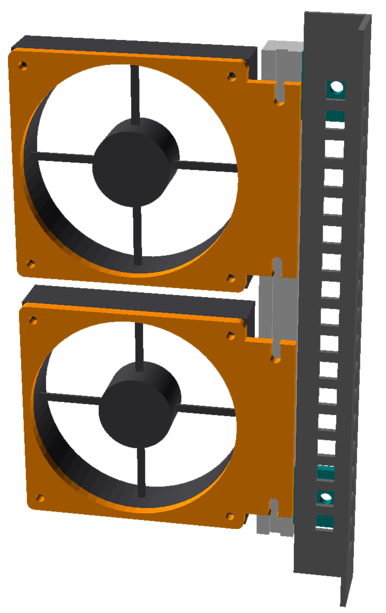

# Coolio — Rack Fan Mount

Parametric OpenSCAD model for a modular Raspberry Pi rack fan mount. Two
120 mm fans per side, mounted on a 2020 extrusion spine across 6U,
cantilevered off one rail and reaching ~80 mm into the rack (140 mm budget).

## The design

This is a way to add real airflow to a standard 19" rack without permanently
modifying it. The full write-up and reasoning live in the blog post,
[*It's Coolio*](https://danieljsamson.com/blog/it-s-coolio); the short version
follows.

### Why it's shaped this way

A standard rack follows the **EIA-310** spec: three holes per 1U with
deliberately *asymmetric* spacing. That irregular pitch trips up most designs,
which wrongly assume holes are evenly spaced. Rather than fight the pattern,
this mount touches the rail in as few places as possible and carries everything
else on its own structure.

The result is three interconnected parts:

1. **M6 bracket** — bolts to the existing rack rail via cage nuts.
2. **2020 aluminium extrusion spine** — the central structural member
   (267 mm / 6U, customisable). Everything hangs off this, not the rail.
3. **Fan carriers** — two flat 120 mm fan plates that bolt to the spine.

Because the parts are decoupled, any one of them can be reprinted or remade
without touching the others.

### Fitting two fans in 6U

6U is 266.7 mm. Two 120 mm fans stack into that height with ~27 mm of
headroom left for the carrier and gaps — tight, but it fits.

### Engineering notes

- **Vibration.** An unbalanced fan rotor produces periodic forces. Rubber
  anti-vibration washers under the fan screws break the mechanical path between
  the fan and the printed carrier, so the rack isn't driven at the fan's
  rotation frequency.
- **Materials.** PETG (glass transition ~75–80 °C) is fine for the carriers;
  ASA (~95–100 °C) is better for the load-bearing bracket. PA12 nylon is the
  premium option for strength and heat resistance if you can print or order it.

### Driving the fans

The fans are 4-pin PWM, controlled from a Raspberry Pi: 25 kHz PWM on GPIO18,
tach read on GPIO24 (pulled up to **3.3 V — never 5 V**), 12 V from a separate
supply with a common ground.

## Files

| File | What it is |
|------|------------|
| `config.scad` | Shared dimensions — the single source of truth. Edit numbers here. |
| `fan_carrier.scad` | **The part you fabricate** (one per fan). Flat profile: print or waterjet/CNC. |
| `spine.scad` | 2020 extrusion spine (you buy this; modelled for the assembly). |
| `bracket.scad` | Rack-mount bracket: post → spine, via M6 cage nuts. |
| `rack_post.scad` | Rack post, for context only (not fabricated). |
| `fan_dummy.scad` | Stand-in 120 mm fan, for fit/clearance only (you buy the real fan). |
| `assembly.scad` | The whole thing, built from the real part modules. |

## Viewing

Open `assembly.scad` in OpenSCAD, press F5, drag to orbit. All files include
`config.scad`, so change a dimension once and every part plus the assembly
update together.

## Fabricating

Open `fan_carrier.scad`, press F6, then export STL (or 3MF). It is a single
uniform thickness, so the same profile suits FDM/SLS printing or waterjet/CNC
from sheet. Set `thickness` in `config.scad` per process (6 mm is a good start).
Flip `side = "left"` for the mirrored part on the other rail.

## Notes

- Fan holes are plain M4 clearance for screws with rubber anti-vibration washers.
- Carrier bolts to the spine via two slotted M5 holes into T-nuts (±6 mm height adjust).
- The fan and rack post are stand-ins; the real carrier, spine slot, and bracket are the load path.

## Status

Mechanical design is complete. Remaining work: manufacturing quotes and a
temperature-controlled fan-speed system.
